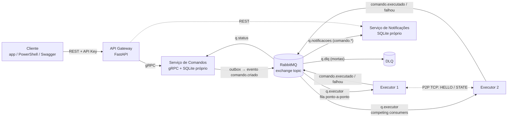
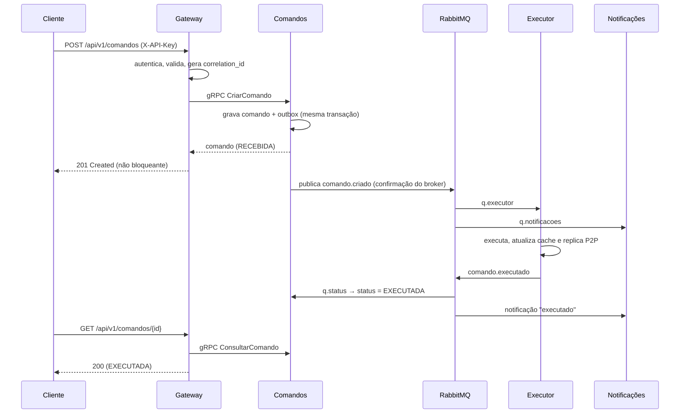

# Documentação Técnica – ARP 01

**Universidade Evangélica de Goiás – UniEvangélica**
**Disciplina:** Arquiteturas de Sistemas Distribuídos
**Aluno:** Jonatan Mariano da Silva — **Matrícula:** 2320518
**Contexto atribuído:** Cidade inteligente (automação residencial)

---

## 1. Contexto escolhido

Em uma cidade inteligente, moradores controlam dispositivos de suas residências (luzes, ar-condicionado, trancas, cortinas, câmeras, tomadas) por aplicativos. A **Entidade Central** (a "solicitação" do problema-base) é o **Comando de Automação**: um pedido para executar uma ação (`ligar`, `desligar`, `ajustar`, `trancar`, `destrancar`) em um dispositivo de uma residência.

O cliente cria o comando, recebe resposta imediata, acompanha o status (`RECEBIDA → EXECUTADA | FALHA`) e recebe notificações automáticas, enquanto serviços independentes executam o comando de forma assíncrona.

**Classificação (taxonomia da Semana 03):**
- **Sistema pervasivo** (principal): o foco é o ambiente físico e o contexto — dispositivos IoT residenciais.
- **Sistema de informação** (secundário): há persistência transacional, rastreabilidade e integração entre serviços por eventos.

## 2. Arquitetura

### Fluxo ponta a ponta

### Estilos arquiteturais e onde aparecem

| Estilo | Onde |
|---|---|
| **Cliente-servidor** | Cliente ↔ Gateway (REST); Gateway ↔ Serviço de Comandos (gRPC); Gateway ↔ Notificações (REST) |
| **Microsserviços** | Gateway, Comandos, Executor e Notificações: cada um com uma responsabilidade, processo/container e banco próprios |
| **Peer-to-Peer** | `executor-1` e `executor-2` descobrem-se, replicam o cache de estado dos dispositivos e elegem um líder diretamente, por sockets TCP, sem passar pelo gateway |

## 3. Decisões arquiteturais

| Decisão | Justificativa |
|---|---|
| **gRPC** entre Gateway e Comandos | Contrato tipado (`.proto`), baixa latência (HTTP/2 + Protocol Buffers) e menor acoplamento de formato que REST interno. Atende A4/RF07. |
| **Sockets TCP brutos** no P2P | Controle de baixo nível, sem broker no meio; TCP garante entrega confiável das mensagens entre pares. |
| **RabbitMQ com exchange `topic`** | Um mesmo evento alimenta a fila de execução (ponto-a-ponto, um consumidor por mensagem) e a de notificações (pub/sub, todos os interessados): usa os **dois** paradigmas da Semana 05. |
| **Padrão Outbox** no serviço de Comandos | Estado e evento são gravados na mesma transação; um publicador envia depois. Se o broker cair, o cliente continua criando comandos (RNF01, RNF08). |
| **Banco por serviço (SQLite)** | Persistência isolada por serviço (RF03/A3), simples de executar localmente. |
| **Idempotência no executor** | Como a entrega é *at-least-once*, o executor descarta comandos já processados. |
| **Configuração por variáveis de ambiente** | Endereços (`PROCESSING_ADDR`, `RABBITMQ_URL`, `PEERS`…) e segredos ficam fora do código (RNF03, RNF07). |

### Semântica de entrega de mensagens: **at-least-once**

- O publicador usa *publisher confirms* e só marca o evento como enviado após a confirmação do broker.
- Filas e mensagens são duráveis (`delivery_mode=2`).
- Os consumidores usam **ack manual**, somente após concluir o trabalho.

**Impacto em falhas:** se um executor cair no meio de um comando, a mensagem volta à fila e outra instância a processa — nenhum comando se perde, mas pode haver **duplicata**, tratada pela idempotência (`processados`). Se o broker cair, os eventos ficam na outbox e são publicados quando ele voltar. Limitação assumida: se o executor cair após executar e antes de publicar o resultado, o status pode demorar a refletir até haver reprocessamento.

### Consistência eventual (RNF04)

`POST` retorna `RECEBIDA`. O status muda para `EXECUTADA`/`FALHA` apenas quando o evento de resultado é consumido pelo serviço de Comandos, normalmente em ~1 segundo (0,5 s simulados de execução + entrega). Consultas nesse intervalo devem ser tratadas como estado transitório. O cache P2P entre executores também é eventualmente consistente (política *last-writer-wins* por versão/timestamp; sincronização total a cada heartbeat de 3 s).

### Tratamento de falhas e DLQ (RF10)

- Mensagem **malformada** (JSON inválido ou campos ausentes): `basic_reject(requeue=False)` → vai direto à `q.dlq`.
- Falha na execução (dispositivo não responde): até **3 tentativas** com espera crescente; esgotadas, o executor publica `comando.falhou` (status `FALHA` para o cliente) e rejeita a mensagem → `q.dlq`.
- Demonstração: dispositivo cujo id contém `defeituoso` sempre falha.

### Cooperação P2P (RF08)

- **Descoberta:** cada instância envia `HELLO` (com snapshot) aos endereços em `PEERS` a cada 3 s; a resposta `HELLO_ACK` identifica o par.
- **Replicação:** a cada mudança de estado, o executor envia `STATE` diretamente ao par.
- **Eleição simplificada de líder:** entre as instâncias vivas, o maior ID vence (Bully determinístico). Um par sem heartbeat por 10 s é considerado perdido e a eleição é refeita.
- Verificável em `http://localhost:8011` e `http://localhost:8012` (líder, pares vivos e cache).

## 4. Mapeamento dos requisitos

### Funcionais

| RF | Atendimento | Onde |
|---|---|---|
| RF01 | `POST /api/v1/comandos` | `gateway/main.py` |
| RF02 | Validação Pydantic; 400 (dados inválidos), 401, 404, 503, 201 | `gateway/main.py` |
| RF03 | 3 microsserviços de domínio (Comandos, Executor, Notificações), cada um com armazenamento próprio | `processing/`, `executor/`, `notification/` |
| RF04 | Eventos `comando.criado`, `comando.executado`, `comando.falhou` a cada mudança de estado | `common/broker.py`, `processing/`, `executor/` |
| RF05 | Executor e Notificações reagem aos eventos sem chamada síncrona | `executor/main.py`, `notification/main.py` |
| RF06 | `GET /api/v1/comandos/{id}` | `gateway/main.py` |
| RF07 | gRPC Gateway → Comandos; sockets TCP entre executores | `proto/`, `executor/p2p.py` |
| RF08 | P2P entre `executor-1` e `executor-2` | `executor/p2p.py` |
| RF09 | Log JSON com timestamp e `correlation_id` em todos os serviços | `common/logs.py` |
| RF10 | Retentativas limitadas + DLQ (`q.dlq`) | `executor/main.py`, `common/broker.py` |
| RF11 | Cabeçalho `X-API-Key` validado no gateway | `gateway/main.py` |
| RF12 | OpenAPI/Swagger em `/docs` + README | `gateway/`, `README.md` |

### Não funcionais

| RNF | Atendimento |
|---|---|
| RNF01 | Sem Notificações ou Executores, criar e consultar comandos continua funcionando; só `/notificacoes` responde 503. Se o broker cair, a outbox segura os eventos. |
| RNF02 | Duas instâncias do executor consomem a mesma `q.executor` (*competing consumers*); o RabbitMQ distribui uma mensagem por vez a cada uma (`prefetch=1`). |
| RNF03 | Serviços se encontram por nome de fila/tópico e variáveis de ambiente/DNS do Compose; nenhum IP fixo no código. |
| RNF04 | Consistência eventual documentada na seção 3. |
| RNF05 | `correlation_id` gerado (ou recebido em `X-Correlation-ID`), propagado por gRPC, mensagens AMQP e logs; devolvido no cabeçalho da resposta. |
| RNF06 | `docker compose up --build`. |
| RNF07 | Segredos em `.env` (ignorado pelo Git); apenas `.env.example` versionado. |
| RNF08 | `POST` responde após gravar comando+outbox, antes de qualquer execução. |
| RNF09 | Cada serviço tem Dockerfile próprio e pode ser reiniciado isoladamente (`docker compose restart executor-1`). |

## 5. Limitações conhecidas

- O serviço de Comandos roda em **uma** instância (SQLite em arquivo local). Para escalá-lo, seria necessário um banco compartilhado (ex.: PostgreSQL).
- O "dispositivo" é simulado (espera de 0,5 s); a integração real (MQTT/Zigbee) seria uma evolução natural.
- O canal gRPC é sem TLS e a autenticação é uma chave de API simples, adequados ao escopo didático.

## 6. Evidências de funcionamento

Roteiro automatizado em `evidencias/testes.ps1`, que cobre: criação (201), consulta (EXECUTADA), notificações, validação (400), autenticação (401), retentativas + DLQ e estado P2P replicado. Para a entrega, grave um vídeo curto (até 5 min) executando o script, mostrando o painel do RabbitMQ (`q.dlq`) e os logs (`docker compose logs -f`).
